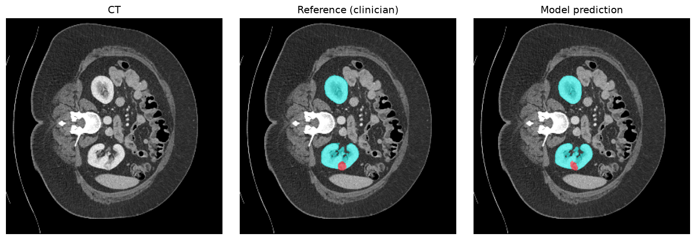
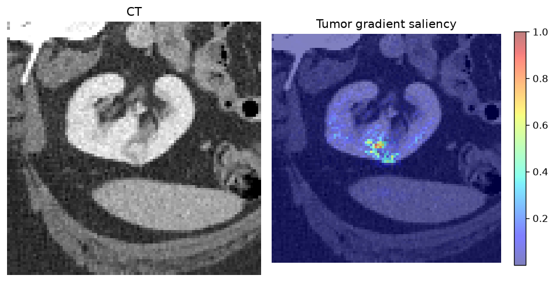

# Kidney and Renal Mass CT Segmentation, with the Governance to Match

An end to end medical imaging system that does the part most projects skip: it
not only trains a 3D segmentation model on real DICOM data, it carries the
validation, transparency, and lifecycle governance that regulated clinical use
actually requires.

The model segments kidney and renal mass on contrast enhanced abdominal CT using
MONAI. Around it sits the layer that makes a model trustworthy for clinical
settings: a standalone validation report with subgroup performance, a clinical
model card, a one page Model Facts label, an illustrative FDA style Predetermined
Change Control Plan, a mapping to Good Machine Learning Practice, and a working
production drift monitoring module.

> The clinical and regulatory documents here are illustrative and educational.
> This is a portfolio project, not a medical device and not a regulatory
> submission. The PCCP is grounded in FDA **final** guidance (Dec 2024); the
> model card and lifecycle material follow FDA **draft** guidance (Jan 2025,
> not for implementation). That distinction is called out in the docs on purpose.

## Why this project

Most machine learning engineers can train a segmentation model. Most governance
specialists never touch one. The job market for regulated medical imaging AI
rewards the rare overlap: someone who can build the model and own its validation,
risk, and monitoring. This repository is that overlap made concrete on a real
clinical dataset.

## Data

[C4KC-KiTS](https://www.cancerimagingarchive.net/collection/c4kc-kits/) from The
Cancer Imaging Archive: 210 patients of contrast enhanced abdominal CT with
clinician drawn kidney and mass segmentations distributed as real DICOM-SEG
objects. License CC BY 3.0, no data use agreement required.
DOI [10.7937/TCIA.2019.IX49E8NX](https://doi.org/10.7937/TCIA.2019.IX49E8NX).

Ingestion is genuine DICOM. `src/tcia_download.py` pulls each DICOM-SEG, resolves
the exact CT series it was drawn on through the referenced series link, and
downloads that CT. `src/convert_to_nifti.py` reads the CT series and the
DICOM-SEG through the same reader so both land in one coordinate convention,
merges the two segments into a labelmap (0 background, 1 kidney, 2 mass, with
mass taking priority on overlap), aligns them, and caches NIfTI pairs. Alignment
is validated case by case: voxel counts match an independent reconstruction and
the CT intensity under each mask falls in soft tissue range.

## Model and training

3D SegResNet, three classes, patch based training at 96 cubed on 1.5 mm isotropic
volumes with an abdominal HU window, Dice plus cross entropy loss, mixed
precision, cosine schedule, and sliding window inference for validation. It
trains on a single 16GB GPU. Metrics are per class Dice and 95th percentile
Hausdorff distance.

```
pip install -r requirements.txt
python src/tcia_download.py --out /data/c4kc-kits
python src/convert_to_nifti.py --in /data/c4kc-kits --out /data/c4kc-kits-nifti
python src/train.py --cache-dir /data/c4kc-kits-cache --epochs 200
python src/evaluate.py --checkpoint outputs/best.pt
```

## Results

<!-- RESULTS: filled from outputs/metrics.json by evaluate.py; see docs/VALIDATION_REPORT.md -->
Standalone performance on the held out test split (32 cases), each metric with a
bootstrap 95% confidence interval:

| Class | Dice | HD95 (mm) | Sensitivity | Specificity |
|---|---|---|---|---|
| Kidney | 0.920 (0.889 to 0.946) | 14.2 | 0.917 | 0.999 |
| Tumor | 0.669 (0.577 to 0.755) | 37.4 | 0.658 | 1.000 |

Kidney segmentation lands in the published KiTS range; the tumor class is harder
and lower, which the validation report and model card state plainly rather than
hide. Full per class numbers, the subgroup breakdown, and the bootstrap method
are in `docs/VALIDATION_REPORT.md` and summarized in the model card. Every number
comes from a real training run; nothing here is hand entered.

## Governance layer

| Artifact | What it is |
|---|---|
| `docs/VALIDATION_REPORT.md` | Standalone performance vs the clinician reference standard, with 95% CIs and subgroup tables (CLAIM and FUTURE-AI aligned). |
| `docs/MODEL_CARD.md` | Clinical model card on the CHAI Applied Model Card structure, aligned to the FDA example model card. |
| `docs/MODEL_FACTS.md` | One page clinician facing label (Sendak et al.) with explicit uses, directions, and warnings. |
| `docs/PCCP.md` | Illustrative Predetermined Change Control Plan following the FDA final guidance (Dec 2024): description of modifications, modification protocol, impact assessment. |
| `docs/GMLP_MAPPING.md` | Each of the ten Good Machine Learning Practice principles mapped to what this project does. |
| `src/monitor.py` | Working drift monitoring: embedding MMD and KS, output PSI and Jensen Shannon, Mahalanobis out of distribution detection. Its thresholds are the triggers in the PCCP modification protocol. |
| `docs/TENSORRT_DEPLOYMENT.md` | TensorRT FP32 and FP16 engines evaluated at the validated Dice, with per volume latency. |
| `monailabel_app/` | MONAI Label app serving the model to annotation clients, with a REST driven evaluation. |
| `bundle/` | MONAI Bundle: schema validated, version pinned, reproducible packaging of the model and its inference pipeline. |

## TensorRT deployment

The trained model is deployed with TensorRT and checked at the validated accuracy, not just
timed. Same sliding window inference, same 32 held out volumes, scored per class and voxel by
voxel against the validated configuration.

| backend | seconds per CT volume | speedup | kidney Dice | tumor Dice |
|---|---|---|---|---|
| PyTorch FP32 | 3.142 | 1.00x | 0.9201 | 0.6687 |
| PyTorch AMP (validated) | 1.344 | 2.34x | 0.9201 | 0.6687 |
| TensorRT FP32 | 1.299 | 2.42x | 0.9201 | 0.6687 |
| **TensorRT FP16** | **0.360** | **8.72x** | 0.9201 | 0.6688 |

TensorRT FP16 is 3.7x faster than the mixed precision configuration that was validated, changes
758 voxels across all 32 volumes, and moves no per case Dice by more than 0.0006. Engines are built
with the TensorRT Python API directly and run on a dedicated CUDA stream. Method, engine build
times and limits are in `docs/TENSORRT_DEPLOYMENT.md`.

```
python src/deploy_tensorrt.py --checkpoint outputs/best.pt
```

## Annotation workflow with MONAI Label

`monailabel_app/` serves the trained model through MONAI Label, so an annotation client such as 3D
Slicer or OHIF can ask for a pre segmentation, correct it, and save the correction back. The app
reuses the validated preprocessing and sliding window settings, and MONAI Label's `Restored`
transform returns the label on the original CT grid, which is what a viewer overlays.

`monailabel_app/evaluate_server.py` drives a running server exactly as a client does, over the
REST API, for all 32 held out cases: request a segmentation, score it against the clinician
reference, and for 3 cases save a label back as a stand in for a radiologist's corrected mask.

| measured through the MONAI Label REST API | result |
|---|---|
| kidney Dice, original CT grid, 32 cases | 0.930 mean, 0.960 median |
| tumor Dice, original CT grid, 32 cases | 0.676 mean, 0.774 median |
| labels returned on the reference CT grid (shape and affine) | 32 of 32 |
| seconds per request, load to returned label file | 4.39 median, 8.90 p95 |
| labels saved back, datastore after | 3 saved, datastore reports 3 of 32 completed |
| next study from the random strategy | a study not yet labelled |

These Dice values are slightly higher than the 0.920 and 0.669 in the validation report because they
are scored on the original CT voxel grid, while `evaluate.py` scores on the 1.5 mm resampled grid.
It is the same model and the same predictions measured in a different space, not an improvement.
Request time includes reading the CT, resampling, GPU inference, restoring to the original grid,
writing the NIfTI label and the HTTP transfer.

```
pip install -r monailabel_app/requirements.txt
python -m monailabel.main start_server --app monailabel_app --studies <folder of CT .nii.gz>     --conf model_path outputs/best.pt --port 8765
python monailabel_app/evaluate_server.py --server http://127.0.0.1:8765 --dataset <dataset.json>
```

The app defines inference and two sample selection strategies. It does not define a training task,
so corrected labels are stored but not used to retrain the model here.

## Explainability

`src/explain.py` produces two views per case: a prediction versus reference
overlay built with MONAI's `blend_images`, and a tumor class gradient saliency map
that backpropagates the summed tumor logit to the input voxels. Together they show
where the model agrees with the clinician and what input regions drive the tumor
prediction. Gradient saliency is used in place of occlusion sensitivity because the
network is a dense segmentation model rather than a classifier.





## Repository layout

```
src/        ingestion, conversion, training, evaluation, TensorRT deployment, explainability, monitoring
bundle/     MONAI Bundle (configs/metadata.json, configs/inference.json, models/)
docs/       validation report, model card, model facts, PCCP, GMLP mapping
tests/      pytest suite for the data, transforms, monitoring, and TensorRT engine parity
```

## Honest limitations

Single collection validation; performance on other scanners, sites, protocols,
and populations is unverified. The reference standard is semiautomatic clinician
annotation with inherent inter reader variability. Mass segmentation is the
harder task and carries lower, more variable performance than kidney. Clinical
validation of the human plus AI team (a reader study) is described in the docs,
not performed.

## License

Code is MIT (see `LICENSE`). The C4KC-KiTS imaging data is CC BY 3.0 and is not
redistributed here; download it from TCIA with the script provided.
