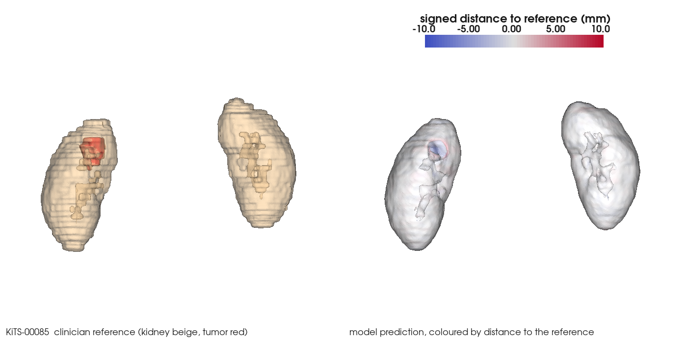
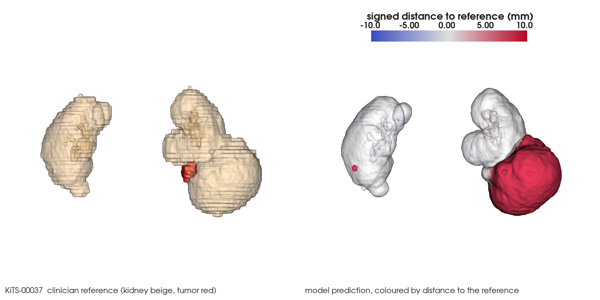

# ITK and VTK: independent ingestion, resampling and 3D surfaces

The training pipeline reads DICOM with MONAI and resamples with MONAI. This part rebuilds those
steps with ITK, checks the two stacks against each other voxel by voxel, measures what resampling
does to the clinician reference, and turns the labels into closed 3D meshes with VTK. Every number
below comes from `outputs/itk_dicom.json`, `outputs/itk_resample.json` and `outputs/vtk_surfaces.json`.

```
python src/save_predictions.py --out <pred dir> --device cpu     # masks for the 32 held out cases
python src/itk_dicom.py --cases all --controls 5 --nifti-roundtrip 5
python src/itk_resample.py --pred-dir <pred dir>
python src/vtk_surfaces.py --pred-dir <pred dir>
python src/vtk_surfaces.py --pred-dir <pred dir> --render KiTS-00085,KiTS-00037
```

## 1. DICOM to NIfTI with ITK, checked against the MONAI path

`src/itk_dicom.py` reads each CT series with `itk.GDCMSeriesFileNames` (slices ordered by Image
Position Patient along the slice normal) and `itk.ImageSeriesReader` with `GDCMImageIO` (Rescale
Slope and Intercept applied). The DICOM-SEG goes through highdicom, and every frame is placed on
the CT slice named by its Referenced SOP Instance UID, not by frame order. The position stored in
each SEG frame is then compared with the physical position of that CT slice.

The comparison with the cached NIfTI that training uses never resamples. Both grids hold the same
voxels in different axis conventions (ITK LPS, NIfTI RAS), so the array is mapped by permutations
and flips derived from the direction matrices, and the origins must coincide.

| all 210 C4KC-KiTS cases | result |
|---|---|
| cases identical to the MONAI path (HU, labels, spacing, origin) | **210 of 210** |
| CT slices read | 45,373 |
| SEG frames placed by referenced UID | 90,746 |
| largest distance between a SEG frame and its CT slice | 0.0001 mm |
| largest origin difference | 0.0 mm |
| NIfTI written by `itk.imwrite` and read back, identical to the MONAI cache | 5 of 5 checked |
| median seconds to read one CT series and its SEG with ITK | 1.6 |

209 scans have an identity direction matrix. KiTS-00160 is acquired with an in plane rotation of
about 4 degrees (Image Orientation Patient 0.9976, 0.0699, 0) and still matches voxel for voxel,
so the direction handling is exercised on real data, not only on axis aligned scans.

**Negative controls.** A check that always says "identical" proves nothing, so three realistic
ingestion bugs are applied to the ITK result in memory for 5 cases each:

| injected bug | flagged | how it shows up (KiTS-00002) |
|---|---|---|
| label flipped left to right, image untouched | 5 of 5 | 1,147,860 label voxels disagree |
| slice order reversed in image and label | 5 of 5 | 4,093 HU maximum difference, 809,284 label voxels |
| origin shifted by half a voxel | 5 of 5 | 0.83 mm origin mismatch, voxels identical |

Two controls I tried first turned out to be no operations on this data and were replaced: ignoring
the direction matrix changes nothing when it is the identity, and stacking SEG frames in file
order gives the right answer because these SEGs store frames in slice order.

## 2. Resampling to the 1.5 mm training grid

`src/itk_resample.py` resamples the 32 held out cases with `itk.ResampleImageFilter` and compares
with MONAI `Spacingd`, which training and `evaluate.py` use.

**ITK reproduces MONAI exactly once two conventions are matched.**

| 32 held out cases | result |
|---|---|
| identical grid (size, origin, spacing) | 32 of 32 |
| HU difference, linear (ITK) vs bilinear (MONAI) | 0.0 maximum |
| label voxels that differ, nearest neighbour | 54,127 in 21 cases |
| of those, not at an exact half voxel tie | **0** |

Getting there took two findings, both now documented in the code:

* **Grid size.** MONAI spans voxel centres, `round((n - 1) * spacing / 1.5) + 1`, not
  `ceil(n * spacing / 1.5)`. For a 91 slice, 5 mm scan that is 301 slices, not 304.
* **Edges.** The last 1.5 mm row can sit past the last input voxel centre. ITK returns 0 there and
  MONAI clamps to the edge (`padding_mode="border"`). On KiTS-00085 that one convention produced a
  2,048 HU difference on two faces of the volume and nothing anywhere else. Replicate padding with
  `ZeroFluxNeumannPadImageFilter` removes it.

The remaining label differences are ties: an output voxel whose continuous input index is exactly
k + 0.5. ITK rounds up, torch rounds half to even. On KiTS-00085 all 976 differing voxels sit on
the three slices whose index is 40.5, 46.5 and 52.5; the slices at 43.5 and 49.5 round the same way
in both libraries and do not differ.

**What resampling does to the clinician reference.** The reference is resampled to 1.5 mm and back
to its original grid, then scored against itself. A perfect model evaluated this way cannot beat
the round trip Dice.

| reference only, 32 cases | kidney | tumor |
|---|---|---|
| volume change at 1.5 mm, nearest (MONAI), mean absolute | 0.22% | 1.24% |
| volume change at 1.5 mm, ITK label Gaussian, mean absolute | 0.11% | 0.75% |
| round trip Dice, nearest (MONAI and ITK agree) | 0.979 | 0.967 |
| round trip Dice, ITK label Gaussian (sigma 0.75 mm) | 0.988 | 0.981 |
| worst case round trip Dice, nearest | 0.970 | 0.916 |

Nearest neighbour resampling alone costs the reference 2 Dice points on kidney and 3 on tumor.
`LabelImageGaussianInterpolateImageFunction` cuts that loss by about 40% on both classes. It gave wrong labels on a padded
input (tumor round trip Dice 0.61 instead of 0.976 on KiTS-00037), so it runs unpadded.

**Where the grid gap in the README comes from.** `evaluate.py` scores on the 1.5 mm grid and the
MONAI Label evaluation scores on the original CT grid (kidney 0.920 against 0.930). Restoring the
same saved predictions to the original grid and scoring there:

| mean Dice, 32 cases | kidney | tumor |
|---|---|---|
| 1.5 mm grid, as in `evaluate.py` | 0.9201 | 0.6687 |
| original grid, prediction restored with nearest neighbour | 0.9229 | 0.6723 |
| original grid, prediction restored with ITK label Gaussian | 0.9283 | 0.6752 |
| MONAI Label evaluation, original grid | 0.930 | 0.676 |

The change of grid and the smoother restore account for 0.0082 of the 0.0099 kidney gap and 0.0065
of the 0.0073 tumor gap. Same model, same predictions, measured in a different space.

## 3. 3D surfaces with VTK

`src/vtk_surfaces.py` builds a mesh per label from the reference and from the prediction on the
1.5 mm grid: `vtkDiscreteFlyingEdges3D`, then `vtkWindowedSincPolyDataFilter` (20 iterations,
pass band 0.01), then a transform into patient millimetres from the image origin, spacing and
direction. The test suite checks that a sphere mesh lands on the physical centroid of its voxels
under a flipped direction matrix, and that concentric spheres 3 mm apart measure 3 mm.

| 32 held out cases | kidney | tumor |
|---|---|---|
| reference mesh volume vs voxel volume, raw, mean | -0.07% | -0.58% |
| reference mesh volume vs voxel volume, smoothed, mean | -0.05% | -0.88% |
| surface area removed by smoothing (staircase) | 12.9% | 11.8% |
| closed manifold meshes (reference and prediction) | 58 of 64 | 60 of 64 |
| median seconds to mesh one label, raw and smoothed | 0.37 | 0.11 |

Every reference mesh is closed. The 10 meshes with open or non manifold edges all come from
model predictions, in 7 of the 32 cases. Volume is the stable measurement:
a surface changes it by well under 1% on kidney. Area is not: the voxel staircase inflates it by
about 13%, so an area read off a raw marching cubes mesh overstates the organ.

### HD95 from meshes, and a units bug it exposed

`vtkDistancePolyDataFilter` gives the distance from every vertex of one mesh to the other surface.
HD95 is then taken the way MONAI defines it, the larger of the two directed 95th percentiles, and
compared with `HausdorffDistanceMetric` from `evaluate.py`.

The first comparison correlated perfectly on kidney (Pearson r 1.000) yet the mesh values ran 1.5
times larger. The cause was in the repository, not in VTK: `evaluate.py` and `deploy_tensorrt.py`
called the MONAI metric without `spacing`, so the published HD95 was in 1.5 mm voxel units. After
passing `spacing`, every per case value grew by exactly 1.5 and the two methods agree:

| 32 held out cases | kidney | tumor |
|---|---|---|
| HD95 from `evaluate.py`, before the fix (voxel units) | 14.2 | 37.4 |
| HD95 from `evaluate.py`, millimetres | **21.3** | **56.1** |
| HD95 from smoothed VTK meshes, millimetres | 21.2 | 69.0 |
| median of (mesh minus voxel) per case | 0.04 mm lower | 0.29 mm higher |
| cases where the two differ by less than 2 mm | 32 of 32 | 30 of 32 |
| mean symmetric surface distance, meshes | 2.4 mm | 11.8 mm |

The two tumor cases that disagree explain the gap in the tumor mean, and they are a property of
HD95 rather than an error in either method. On KiTS-00073 the prediction has small spurious tumor
fragments up to 412 mm from the reference tumor. They hold 5.3% of the prediction mesh vertices,
just over the 5% that HD95 discards, so the mesh HD95 is 354 mm while the voxel HD95, which samples
the same boundary as edge voxels, is 14.7 mm. A cell locator run on the same vertices gives the same
355 mm, so the VTK distance is correct. HD95 flips between those values depending on how the surface
is sampled whenever fragments sit near the 5% cutoff, which is a reason to report the mean surface
distance and a fragment count next to it.

### Renders

Offscreen VTK renders from the front (patient right on the left of each panel). Left panel: the
clinician reference, kidney beige and semi transparent, tumor red. Right panel: the model
prediction, coloured by signed distance to the reference surface of the same class (red outside,
blue inside, clipped at 10 mm). The kidney label excludes tumor voxels, so each kidney surface has
an opening where its tumor sits, and the renal sinus shows through as an inner surface.



KiTS-00085, kidney Dice 0.960, tumor Dice 0.403. Kidney surfaces sit within a millimetre or two of
the reference almost everywhere. The small tumor is found but at about a quarter of the reference
volume (2.2 ml against 8.0 ml), which shows as the blue patch.



KiTS-00037, the lowest tumor Dice in the test set (kidney Dice 0.704, tumor Dice 0.019). The clinician
labelled the large lower pole of the left kidney as kidney with a small tumor beside it. The model
labelled that whole lower pole as tumor (431 ml of predicted tumor against 5.9 ml in the reference),
the saturated red mass, and missed most of the true tumor.
The Dice numbers say this case failed; the render shows how.
